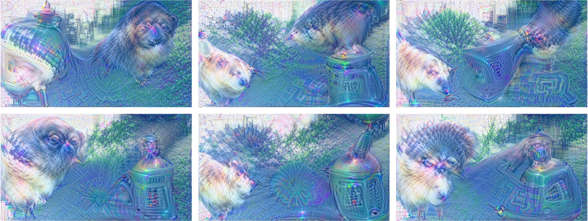
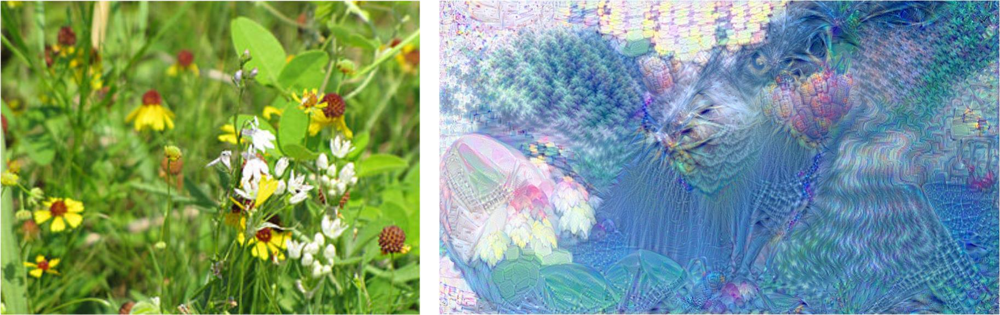

# DeepDream
```
Pytorch Implementation of Google-DeepDream
```

# Introduction in Chinese
https://mp.weixin.qq.com/s/iIhiMKutVtYEUgAiErLkVQ

# Environment
```
OS: Ubuntu 16.04
Graphics card: Titan xp
cuda version: 10.0.130
cudnn version: 7.0.4
Python: python3.x with the packages in requirements.txt
```

# Usage
```
# uncontrolled
python train.py --imagepath imgs/sky1024px.jpg
# controlled
python train.py --imagepath imgs/sky1024px.jpg --controlimagepath imgs/flowers.jpg --iscontrolled
```

# Some Results
#### uncontrolled

#### controlled


# Reference
```
[1]. https://ai.googleblog.com/2015/06/inceptionism-going-deeper-into-neural.html
[2]. https://github.com/google/deepdream
```

# More
#### WeChat Official Accounts
*Charles_pikachu*  
